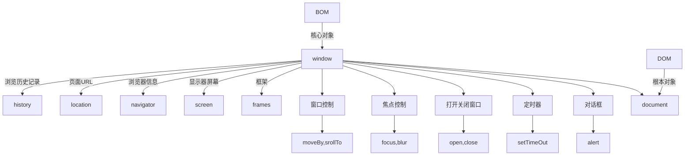

:::tip
js 基本数据类型

基本类型：String、Number、Boolean、Undefined、Null、Symbol
引用类型：Object

js 对象
本地对象

与宿主无关，独立于宿主环境的ECMAScript实现提供的对象。
这些引用类型在运行过程中需要通过 new 来创建所需的实例对象。
包含：Object、Array、Date、RegExp、Function、Boolean、Numb...
:::

<!-- more -->

## 1、BOM 和 DOM

- DOM描述了处理网页内容的方法和接口，BOM描述了与浏览器进行交互的方法和接口。
## 2、js 基本数据类型
- 基本类型：String、Number、Boolean、Undefined、Null、Symbol
- 引用类型：Object、Array、Date、RegExp、Function（统称Object）
## 3、js 对象
### 本地对象
- 与宿主无关，独立于宿主环境的ECMAScript实现提供的对象。
- 这些引用类型在运行过程中需要通过 `new` 来创建所需的实例对象。
- 包含：`Object`、`Array`、`Date`、`RegExp`、`Function`、`Boolean`、`Number`、`String` 等。
### 内置对象
- 与宿主无关，独立于宿主环境的ECMAScript实现提供的对象。
- 在 ECMAScript 程序开始执行前就存在，本身就是实例化内置对象，开发者无需再去实例化。
- 内置对象是本地对象的子集。
- 包含：`Global` 和 `Math`。
- ECMAScript5中增添了 `JSON` 这个存在于全局的内置对象。
>关于全局对象`Global`：全局对象只是一个对象，而不是类。既没有构造函数，也无法实例化一个新的全局对象。
```
Global 的例子：
属性：NaN，Infinity，Undefined
方法：parseInt()，String()，Number()
JSON 的例子：JSON.parse()，JSON.stringify()
```
>本地对象也经常被叫做原生对象或内部对象，把本地对象和内置对象统称为“内置对象”，也就是说除了宿主对象，剩下的都是ECMAScript的内部的“内置”对象。
### 宿主对象
- 所有不是 ***本地对象*** 都属于宿主对象。
- 对于嵌入到网页中的JS来说，其宿主对象就是浏览器提供的对象，浏览器对象有很多，如 `Window` 和 `Document` 等。
- 所有的 `DOM` 和 `BOM` 对象都属于宿主（浏览器）对象。
## 4、判断一个数据是什么类型
typeof
: - 判断参数是什么类型的实例，返回的结果有
`number`、`string`、`boolean`、`object`、`function` 和 `undefined`
: - `typeof(对象，数组和null) = "object" `，所以就产生了一个问题，用typeof检测引用数据类型的话，都是`object`

instanceof
: - 一个对象在其原型链中是否存在一个构造函数的 prototype 属性。
: - 语法：`object instanceof A`
: - 沿着object的 `_proto_` 属性这条线来找，同时沿着A的 `prototype` 属性这条线，若果两条线能找到同一个引用，即同一个对象，则返回true。
: ```javascript
	var a = new Array()
	console.log(a instanceof Array) // true
	
	function test(){}
	var a = new test()
	console.log(a instanceof test) //true
	```
但是，如果 `[] instanceof Object` 也会返回 true ，因为 `Object` 也在这条原型链上。所以还有以下方法来判断⬇️

constructor
: ```javascript
	var o = { 
	           'name':'lee'
	        };
	var a = ['reg','blue'];
	console.log(o.constructor == Object); //true
	console.log(a.constructor == Array); //true
	```
toString()
: ```javascript
	var o = { 
     	'name':'lee'
    };
	var a = ['reg','blue'];
	console.log(Object.prototype.toString.call(a));//[object Array]
	console.log(Object.prototype.toString.call(o));//[Object Object]
	```
jquery方法
: `$.isPlainObject(obj)`
: `$.isArray(obj)`  `Array.isArray(obj)`
: `$.isFunction(obj)`
