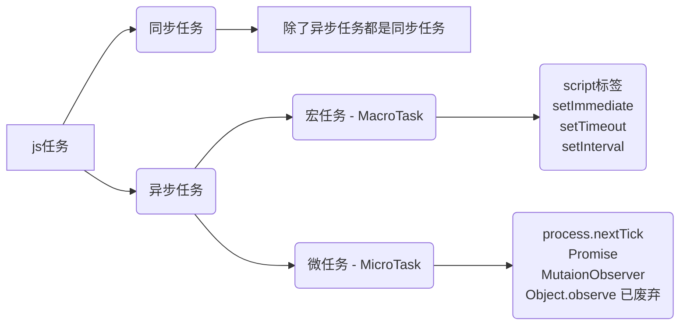

:::tip
概述
今天我们来聊聊 js 的执行机制，事件轮询（event loop）。
问题1：为什么 js 是单线程？
因为 js 是面向客户端的一门语言，主要是用户交互，操作dom，渲染数据。试想一下，如果是多线程，我们在一个线程删除了一个dom节点，另外一个线程添加了一个dom节点，以那个线程为主呢，就会出现混乱的情况。当然你可以说我们在操作一个dom之后加上锁，只允许一个线程操作，这样其实增加了程序的...
:::

<!-- more -->

## 概述
今天我们来聊聊 js 的执行机制，事件轮询（event loop）。
***问题1：为什么 js 是单线程？***
因为 js 是面向客户端的一门语言，主要是用户交互，操作dom，渲染数据。试想一下，如果是多线程，我们在一个线程删除了一个dom节点，另外一个线程添加了一个dom节点，以那个线程为主呢，就会出现混乱的情况。当然你可以说我们在操作一个dom之后加上锁，只允许一个线程操作，这样其实增加了程序的复杂度，并不是一个好办法。所以，js 是一个 单线程语言。
***问题2：单线程产生的问题？***
js 的单线程产生了一个问题，那就是必须要等待前一个程序执行完毕才执行下一个，所以将程序分为了两类：同步任务和异步任务。异步任务又可以分为宏任务和微任务。

***堆与栈？任务队列（event queue）？***
栈：先进后出的数据结构，存储基本数据类型的变量
堆：主要负责像对象Object这种引用数据类型的存储
队列：先进先出的数据结构
任务队列：异步任务才会产生任务队列
***事件轮询是怎么执行的？***
```mermaid
flowchat
st=>start: 开始
e=>end: 结束
macro=>operation: 宏任务
macroend=>operation: 宏任务结束
microend=>operation: 微任务结束
microbegain=>operation: 执行微任务
cond=>condition: 有可执行的微任务？

st->macro->macroend->cond
cond(yes)->microbegain(left)->microend(top)->macro
cond(no)->macro
```
## 例子1（简单）
```javascript
<script>
	console.log(1)
	setTimeout(() => console.log(5), 0)
	new Promise((resolve, reject) => {
	    console.log(2)
	    resolve()
	}).then(() => {
	    console.log(4)
	})
	console.log(3)
</script>
```
1、整个 script 就是一个 宏任务，主线程开始执行任务
2、先执行同步任务 `console.log(1)` ，然后遇到 `setTimeout` 发现是一个异步的宏任务，执行 `setTimeout` 并把注册的回调函数分发到 ***宏任务的事件队列*** 中等待执行
3、然后遇到 `new Promise` ，立即执行 `promise` 函数 `console.log(2)`，并将异步微任务 `promise.then` 注册分发到 ***微任务的事件队列*** 中等待执行，执行同步任务 `console.log(3)`
4、第一轮事件轮询结束，主线程开始检查异步任务，优先检查微任务的事件队列，发现 `promise.then`，执行
5、微任务执行结束后，开始检查宏任务的事件队列，发现 `setTimeout`，执行
## 例子2（复杂）
```javascript
<script>
console.log(1)

setTimeout(() => {
    console.log(5)
    new Promise((resolve, reject) => {
        console.log(6)
        resolve()
    }).then(() => {
        console.log(7)
    })
}, 0)

new Promise((resolve, reject) => {
    console.log(2)
    resolve()
}).then(() => {
    console.log(4)
})

setTimeout(() => {
    console.log(8)
    new Promise((resolve, reject) => {
        console.log(9)
        resolve()
    }).then(() => {
        console.log(10)
    })
}, 0)

console.log(3)
</script>
```
1、整个 script 就是一个 宏任务，主线程开始执行任务 `1`
2、遇到一个宏任务 `setTimeout` ，将其回调函数分发到宏任务的事件队列中，记 `setTimeout1`
3、然后碰到 `promise` 微任务，直接输出 `2` ，将 `promise.then` 放入微任务的事件队列，记 `promise1`
4、又遇到宏任务 `setTimeout`，将其回调函数分发到宏任务的事件队列中，记 `setTimeout2`
5、执行 `3`
此时，第一轮事件轮询结束，主线程会去检查事件队列是否存在微任务，检查到 `promise1`，执行输出 `4`，微任务执行完毕，第一轮事件轮询结束
微任务     | 宏任务
-------- | -----
promise1  | setTimeout1
  &nbsp;    | setTimeout2
 第二轮事件轮询开始
 1、执行 `setTimeout1`，输出 `5`
 2、碰到 `promise`微任务，先输出 `6`，把 `promise.then` 放入微任务的事件队列，记 `promise2`
此时，第二轮事件轮询结束，主线程会去检查事件队列是否存在微任务，检查到 `promise2`，执行输出 `7`，微任务执行完毕，第二轮事件轮询结束
 微任务     | 宏任务
-------- | -----
promise2  | setTimeout2
第三轮事件轮询开始
1、执行 `setTimeout2`，输出 `8`
 2、碰到 `promise`微任务，先输出 `9`，把 `promise.then` 放入微任务的事件队列，记 `promise3`
此时，第三轮事件轮询结束，主线程会去检查事件队列是否存在微任务，检查到 `promise3`，执行输出 `10`，微任务执行完毕，第三轮事件轮询结束，任务队列中无任务。
 微任务     | 宏任务
-------- | -----
promise3  | &nbsp;
