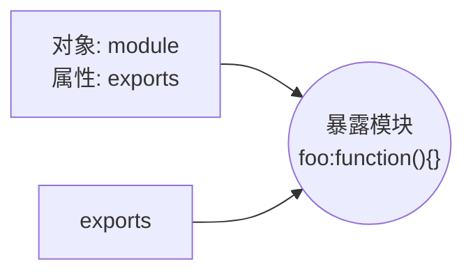
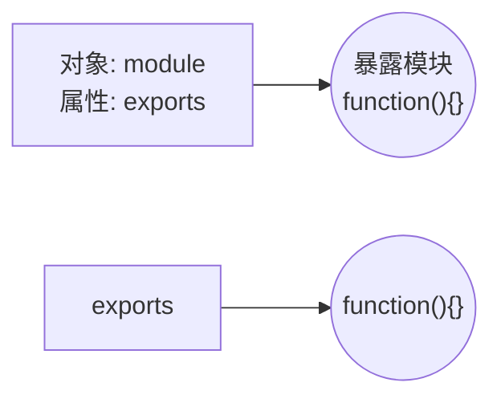

:::tip
概述
module.exports ：首先 module 是一个对象，exports 是 module 中的一个属性，这个属性指向空 {}。
exports：指向 module.exports 的 {}，相当于
var module.exports = {}
var exports = module.exports

require()：实际引用的是 module.exports
例子
modul...
:::

<!-- more -->

es6 的 export 和 import [传送门](https://blog.csdn.net/weixin_43972437/article/details/99976043)
## 概述
`module.exports` ：首先 `module` 是一个对象，`exports` 是 `module` 中的一个属性，这个属性指向空 `{}`。
`exports`：指向 `module.exports` 的 `{}`，相当于
```javascript
var module.exports = {}
var exports = module.exports
```
`require()`：实际引用的是 `module.exports`
## 例子
```javascript
module.exports.foo = function(){}
exports.foo = function(){}
```

接下来，我们将 `foo` 属性去掉
```javascript
module.exports = function(){}
exports = function(){}
```

这时，`exports` 已经指向了一块新的内存，当 `require` 的时候是找的 `module.exports`，所以 `exports` 就不生效了，因此建议大家使用 `module.exports` ，除非你清除的知道他们之间的关系。
